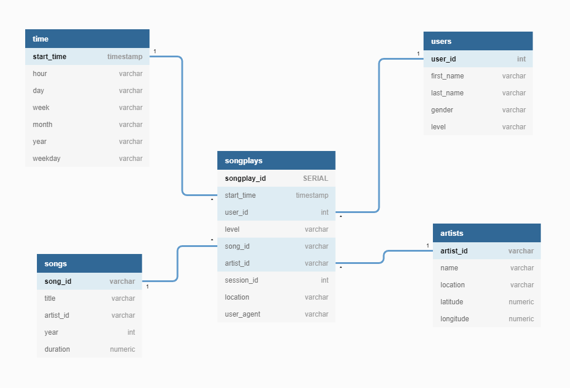

# Project: Data Modeling with Postgres
## Introduction
A startup called Sparkify wants to analyze the data they've been collecting on songs and user activity on their new music streaming app. The analytics team is particularly interested in understanding what songs users are listening to. Currently, they don't have an easy way to query their data, which resides in a directory of JSON logs on user activity on the app, as well as a directory with JSON metadata on the songs in their app.

They'd like a data engineer to create a Postgres database with tables designed to optimize queries on song play analysis, and bring you on the project. Your role is to create a database schema and ETL pipeline for this analysis. You'll be able to test your database and ETL pipeline by running queries given to you by the analytics team from Sparkify and compare your results with their expected results.

## Project Description
In this project, you'll apply what you've learned on data modeling with Postgres and build an ETL pipeline using Python. To complete the project, you will need to define fact and dimension tables for a star schema for a particular analytic focus, and write an ETL pipeline that transfers data from files in two local directories into these tables in Postgres using Python and SQL.

## Data Model
In this project a star schema was implemented with 
- songplays FACT table
- users, songs, artists and time DIMENTION tables

## Python scripts
- Run 'create_tables.py' first to create database and empty tables.
- Then run 'etl.py' to fill all tables accordingly.
- 'sql_queries.py' have all necessary queries. No need to run, just consult if necessary.
- Notebooks 'etl.ipynb', 'reset.ipynb' and 'test.ipynb' were used in development phase and debugging. Feel free to explore if necessary.
- Folder 'data' have the raw data files used to fill the database tables.